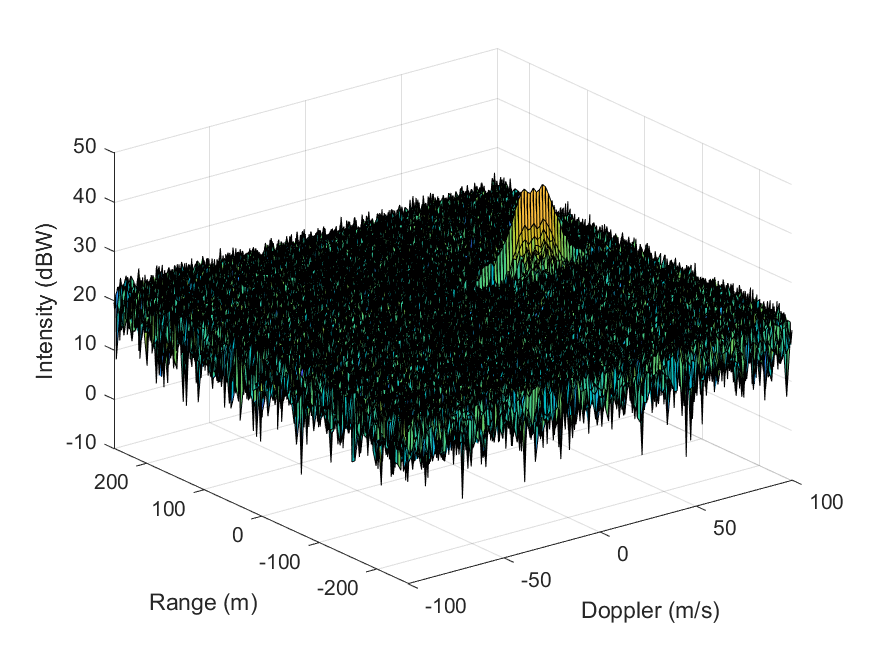
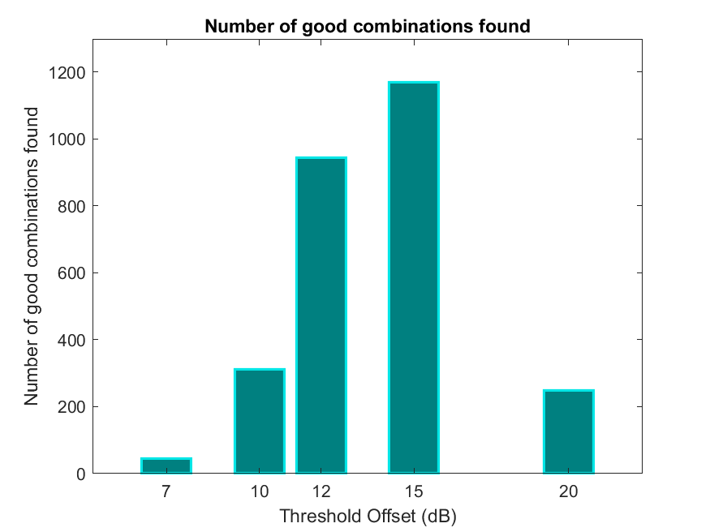

# SFND_Radar

## Implementing 2D-CFAR

CFAR is similar to a moving average filter, except it creates a dynamic threshold over the data. In the figure below, the points of interest (object detected by radar) are the purple peaks and the green flat-ish (but it's not really flat!) surface is the dynamic threshold.

Originally the Range Doppler Response map looked like this before it was filtered using 2D-CFAR.

## Hyper-parameter optimization

While this will likely not work for a live scenario, for this practice dataset, I want to investigate the effects of the number of cells and thresholds a bit more. To do this, instead of relying on trial and error to find the optimal number of training and guard cells, I'm going to recursively iterate on cell sizes between 0:3:15 and thresholds [0, 2, 5, 7, 10, 12, 15, 20, 25]dB to find the most optimal CFAR parameters.

CFAR takes 800ms to run on my local machine. Brute forcing a solution will take `800ms * 6^4 cell-size combinations * 9 thresholds = 9.33*10^6 milliseconds`, so a few hours.

We will retain the best combinations in an array. Best combinations will fulfill the following criteria: `(sum(sum(signal_cfar>35))) > 0 && (sum(sum(signal_cfar>10))) < 30` (This optimal threshold found by the trial and error method described below).

### Best Combinations

- Best combinations are saved in [bestCombinations.mat](./bestCombinations.mat).
- We found 2717 good combinations out of 11664 possible combinations. For this particular dataset, a threshold of 15dB is the best at filtering out clutter, but this is clearly overfitting the data. We see a dip in the number of good combinations at the 20dB threshold likely because our target points start getting chopped away by the high threshold.
    
- There were only 44 combinations at threshold 7dB that were able to filter the points to the criteria that was specified.
  - Out of these 44, a training cell size (dT<9 and rT<9) yielded more good combinations, meaning that larger training grids were filtering out the points of interest.
- Conclusions:
  - the optimal number of cells and threshold depends on the dataset, but beware overfitting the dataset, like the fine niche we found with setting the threshold to 15dB.
  - Setting the cell size too large will average out target points.
  - Setting the cell size too small works for some combinations of hyper-parameters, but not all.
  - Setting the threshold too low will result in a lot of clutter.
  - Setting the threshold too high will filter everything out.
- Future work
  - Generate more waveforms and see if these conclusions still stand.

## Selecting training and guard cells for 2D-CFAR by Trial and Error

### Selecting cells

We'll pad the Cell Under Test (CUT) with training and guard cells.
In 1D, if we picked 5 training and 2 guard cells, our window would look like:

T T T T T G G CUT G G T T T T T

In total, we would have 10 training and 4 guard cells.

In 2D, if we picked 5 range training (rT), 2 doppler training (dT), 2 range guard (rG) and 1 doppler guard (dG), our moving grid would look like:

T T T T T T T T T T T T T T T T T

T T T T T T T T T T T T T T T T T

T T T T T G G G G G G T T T T T

T T T T T G G CUT G G T T T T T

T T T T T G G G G G G T T T T T

T T T T T T T T T T T T T T T T T

T T T T T T T T T T T T T T T T T

In total, the number of training cells = (rT * dT) - (rG * dG). The number of guard cells = rG * dG - 1.

Also, since our CUT is padding by seven cells, we'll skip the first seven cells AND the last seven cells in each dimension and set their signal to 0.

### Notes from selecting training cells

According to the lesson, the number of training cells should be selected based on the environment. In a scene with dense traffic, fewer cells should be used (presumably to avoid overlapping detected bodies). For this exercise, there is only one target, but we still have to be careful not to over filter.

From looking at the RDM raw data generated by the 2D-FFT, for a 512x128 dataset the ROI is about 20x5. We don't want to make the training + guard cells bigger than the range we're looking for so that we don't average out our target.

Using trial and error we'll experiment with training and guard cells < 20 in range.

#### Too many training cells

It looks like if we used too many training cells (>15 cells), everything becomes clutter and we lose our data.

#### Too little training cells

There is too much clutter if we used less than 3 training cells.

### Notes from selecting guard cells

Guard cells are used to protect the target cells from being considered in noise estimate done by the training cells.

### Threshold offset

An offset to the threshold. If the signal strength is logarithmic, the offset should be added, not multiplied.
We'll select the threshold offset by trail and error, we do not want to cut off points we're interested in, but we also don't want to keep too much clutter in the CFAR output.

#### Threshold too high

A high threshold (>20dB) improves detection of the points we're looking for but this may be overfitting the data. A much higher threshold (>50dB) removes all the datapoints from the map.

#### Threshold too low

There is too much clutter if we used threshold <1dB.
